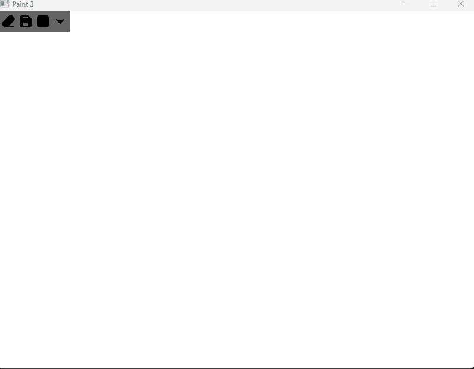

This is a third re-attempt on making a paint app in c++ using SFML. I am going to implement basic paint features like Pen Tool, Eraser, Fill Bucket, save/open drawing, layers, Resizable canvas. 
The file structure is very basic:
i) The .cpp files are in src folder
ii) The headers are in include folder
iii) The fonts and images used are in assets folder

The "utility" files that i create are created in a way that they can be reused in other projects too, like the mouse_utility and button_utility.

**Further information will be uploaded once i will have enogh features to actually talk about**

