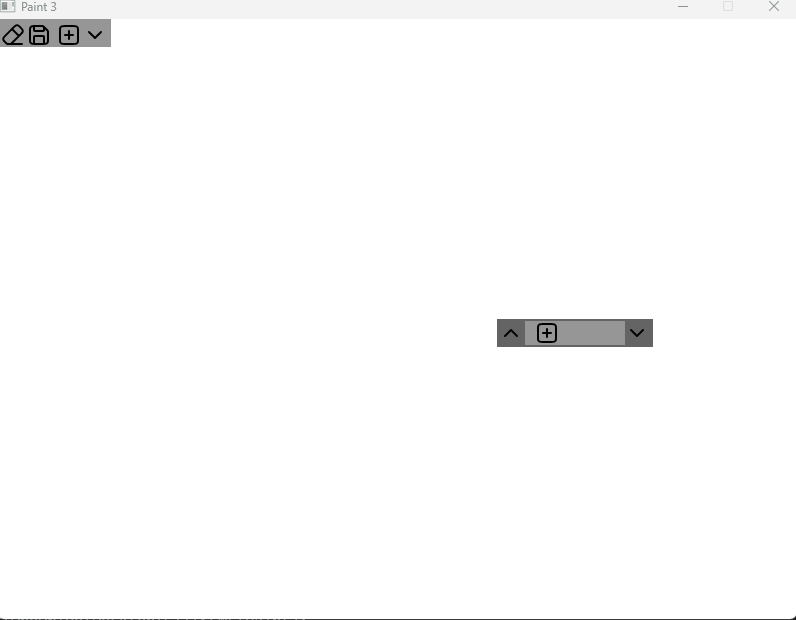

This is the third version of a basic paint app which uses SFML.
This project also includes a basic UI library also written using SFML.
Both are currently WIP, though I have implemented the basic Pen , Eraser Tool, Layers in the Paint app,
and UIElements like buttons,Scrollbar,Static Group and Dynamic Groups.

